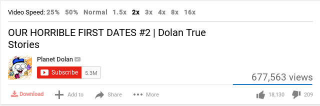
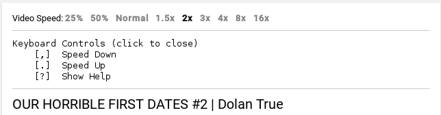
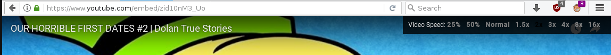
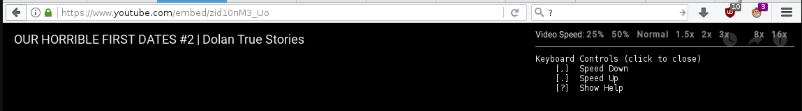
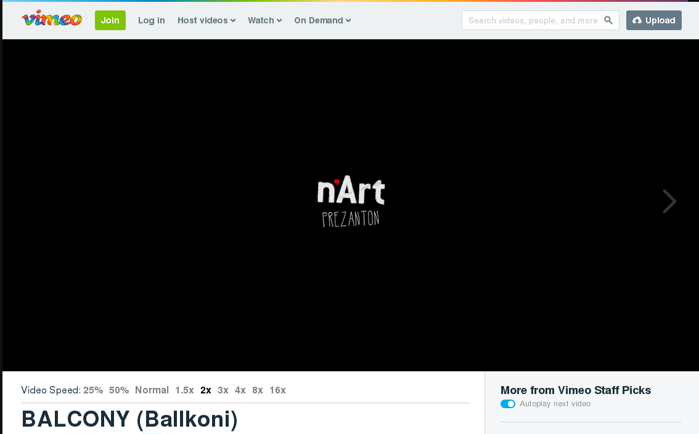
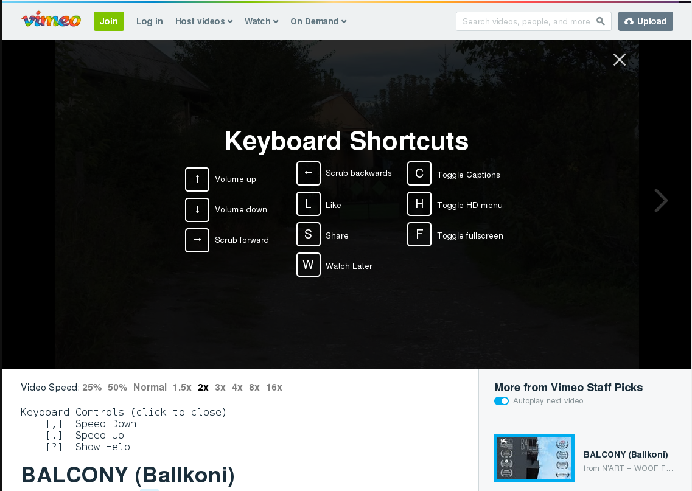
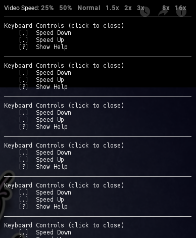

# Video Speed Buttons
### By Braden Best

Video Speed Buttons (VSB) is a userscript I wrote and used to gain finer controls on video playback speed. It is generalized to work with basically any video site.

By default, it comes with 9 buttons

* 25%
* 50%
* Normal (default)
* 1.5x
* 2x
* 3x
* 4x
* 8x
* 16x

Note that 8x and 16x generally only work in Chrome and chrome-like browsers, since its renderer caps speed at 16x. Browsers like Firefox, on the other hand, cap it at 5x. Setting a video to play at 8x in Firefox thus results in a real playback rate of 5x.

The code is written to be as easy as possible to tweak. All of the default values are plainly laid out at the top.

## What does it do?

VSB defines a function `video_speed_buttons(anchor, video)` and `video_speed_buttons.from_query(anchor, video)`, which both take an `anchor` (the insertion point) and a `video` (the video element that the buttons control), and returns an object containing references to the internals.

The difference between `video_speed_buttons` and `video_speed_buttons.from_query` is that the latter takes CSS selector strings like `"div.info_header#container"`, and will do the lookup for you.

    let vsb_handle = video_speed_buttons(document.querySelector(".watch_header"), document.querySelector("video"));
    // is equivalent to...
    let vsb_handle = video_speed_buttons.from_query(".watch_header", "video");

if `video_speed_buttons` receives "falsy" values (`undefined`, `null`, `0`, `""`, `false`, etc.) (for example, `video_speed_buttons.from_query("idontexist", "ialsodontexist")`), the function returns `null`. This makes it easy to sanity check.

    if(!(vsb_handle = video_speed_buttons(...)))
        console.error("Couldn't spawn speed buttons");

You can write your own loader, or use the provided loader, which tries a set of anchors for (currently) YouTube and Vimeo, and defaults to a floating box on the top right (looks really nice on `youtube.com/embed/...` urls).

## Screenshots

### YouTube page

### YouTube /embed/... page

### Vimeo

### Screwing around

## Controls

You can simply click the buttons or use the keyboard.

The controls are, by default

    -  Speed Down
    +  Speed Up
    ?  Show Help

They can easily be configured by modifying `const keyboard_controls` near the top of the `video_speed_buttons` function.

        ...}],
        ["X", "Prints Gibberish", function(unused){
            console.log("asdf");
        }]
    ]

Pressing `Shift + X` (capital `X`) would log `"asdf"` to the console. Pressing `?` would show the following:

    Keyboard Controls (click to close)
        [-]  Speed Down
        [+]  Speed Up
        [?]  Show Help
        [X]  Prints Gibberish

NB: `unused` here is an `event` object. You'll notice it's used in the current controls to prevent pressing those keys while writing a comment from making those actions happen. So when you type a very confused comment asking a lot of questions, you don't have to scroll through a jungle of help boxes.

## Adding more buttons

Pretty much everything can be configured without having to know much JavaScript (just follow the patterns), but I feel like adding another example.

Say you want a `2.5x` button. All you have to do is find `const BUTTON_TEMPLATES` and add your entry where you want it:

    ...
    ["2x",   2],
    ["2.5x", 2.5],
    ["3x",   3],
    ...

Couldn't be simpler.

## Removing

A function `kill` is provided as part of the API returned by `video_speed_buttons`. The function is never used. Calling it `vsb_handle.kill()` removes the buttons from the page and the keyboard listener from the event queue.

## Unexpected stuff

Did you know that these buttons also apparently control YouTube ads? That's right, when your adblocker fails to catch it, you can just blow through those pesky unskippable ads at 16x speed. Pretty cool!
